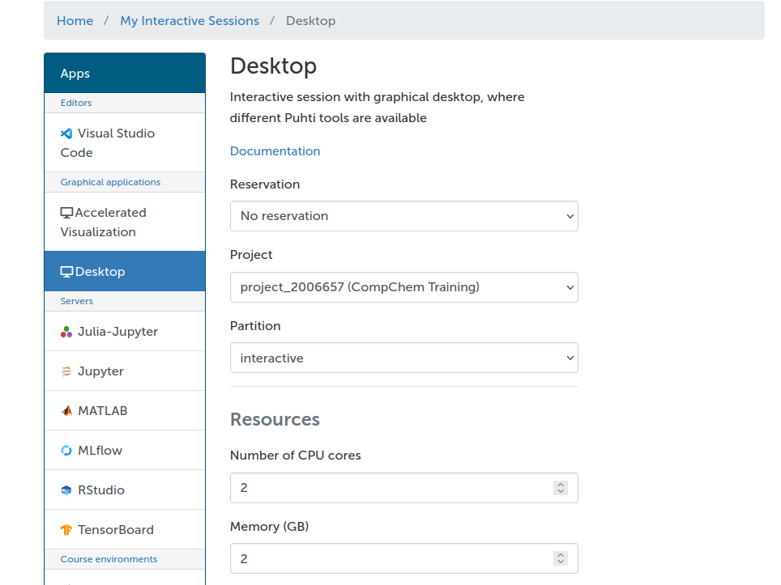
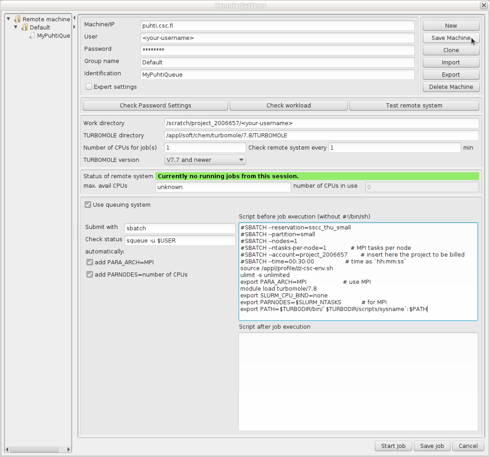

# Setup TmoleX

[TmoleX](https://www.3ds.com/products/biovia/turbomole ) is an easy to use graphical user interface to handle [TURBOMOLE](https://www.turbomole.org/turbomole/turbomole-features/) calculations. TmoleX includes a structure builder and tools for preparing TURBOMOLE jobs and analyzing results. TmoleX can also be used to submit and supervise TURBOMOLE jobs on CSC's supercomputers.


The free TmoleX Client version can be used from your local Windows, Linux, or MacOS desktop to run TURBOMOLE at CSC. It can be freely downloaded (requires registration) from the [Dassault Systèmes website](https://discover.3ds.com/free-download-biovia-turbomole-demo-version). This is a demo version that also includes a restricted version of TURBOMOLE.


## Usage

### Use via your browser

Go to [puhti.csc.fi](https://puhti.csc.fi/) using a web browser and login using
your CSC/Haka user account.
![Slurm settings]
1. From there [launch a Desktop](https://docs.csc.fi/computing/webinterface/desktop/#launching).
		

   * Activate the `Reservation-> sscc_thu_small` that gives access to resourses specially dedicated for this course 
   * Select the project `project_2006657(CompChem Training)` that is used for this course 
   * Go with the default resourses	
   * Once resourses have been allocated `Launch Desktop`  
2. Open a `Terminal` and load the TURBOMOLE module `module load turbomole/7.8`.
3. Start TmoleX with the command `TmoleX24`.
4. Select `New Project` and define a suitable project in the `File Name` slot
   (e.g. `/scratch/project_2006657/<your-username>/qc_tutorial1`).
5. Define your system and type of calculation. 
6. Small jobs can be run interactively: Start Job -> Run (local)
7. Larger jobs should be run as batch jobs: Start Job -> Run (network).

 Example settings are given below.  Remember to save the settings using `Save Machine`.
 
### Install your own TmoleX

Install the TmoleX client on your local workstation. For details, see the
registration and download page at
[Dassault Systèmes website](https://discover.3ds.com/free-download-biovia-turbomole-demo-version).
With your version of TmoleX you can build your actual job locally and then
submit the job to Puhti. With the client you can monitor how the job proceeds.
When the job has completed you can retrieve the output and use your local
client to analyze the results.

Below are some example queue settings that can be used in TmoleX:




Where the complete script to be inserted in the field "Script before job
execution" contains something like (modify according to your actual needs):

```bash
#SBATCH --reservation=sscc_thu_small                  # resource reservation for school
#SBATCH --partition=small                             # queue
#SBATCH --nodes=1                                     # for SMP only 1 is possible
#SBATCH --cpus-per-task=4                             # SMP threads
#SBATCH --account=project_2006657                     # insert here the project to be billed     
#SBATCH --time=00:30:00                               # time as `hh:mm:ss`
source /appl/profile/zz-csc-env.sh
ulimit -s unlimited
export PARA_ARCH=SMP                                  # use SMP threads
module load turbomole/7.8   
export PARNODES=$SLURM_CPUS_PER_TASK                  # for SMP
export PATH=$TURBODIR/bin/`$TURBODIR/scripts/sysname`:$PATH
```

Remember to save the settings using `Save Machine`. 


