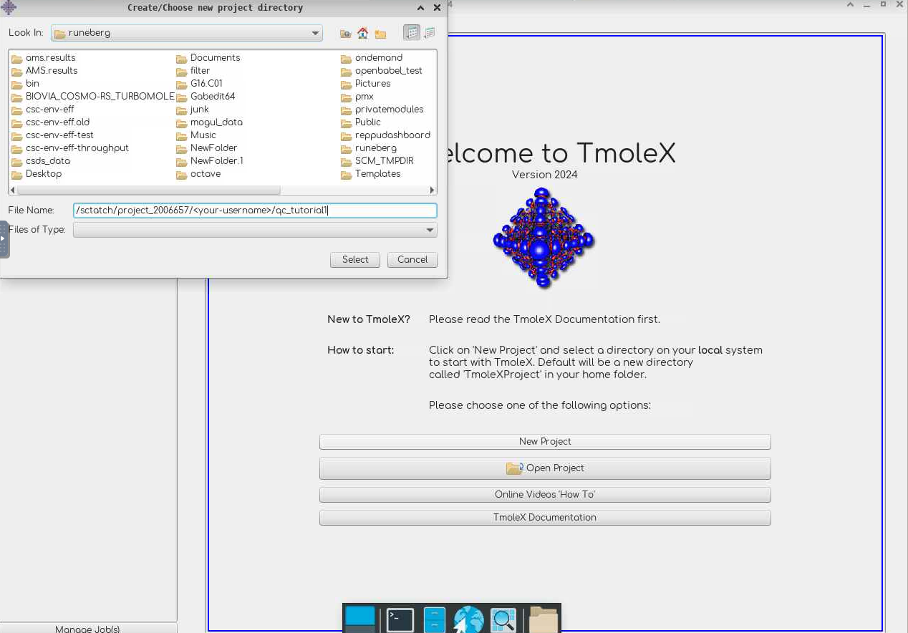
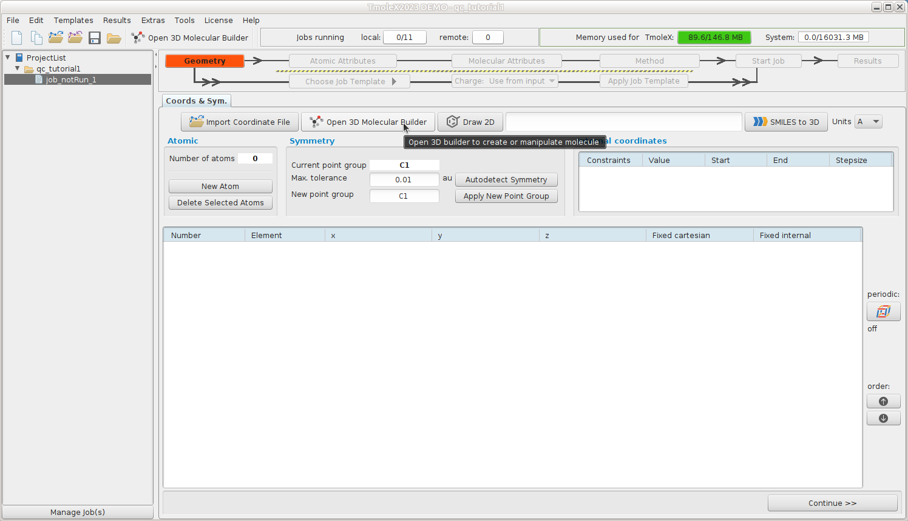
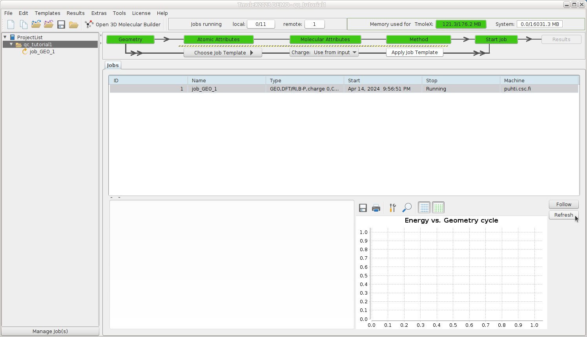
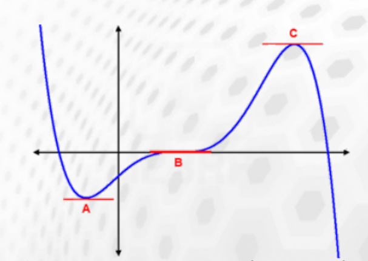
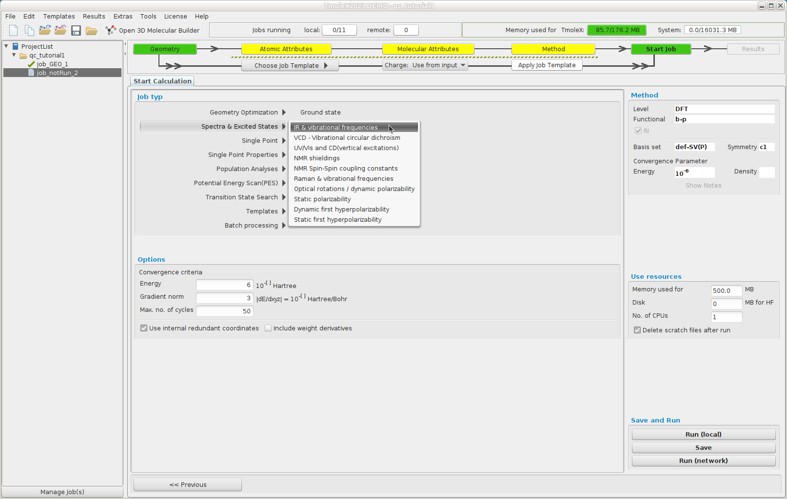
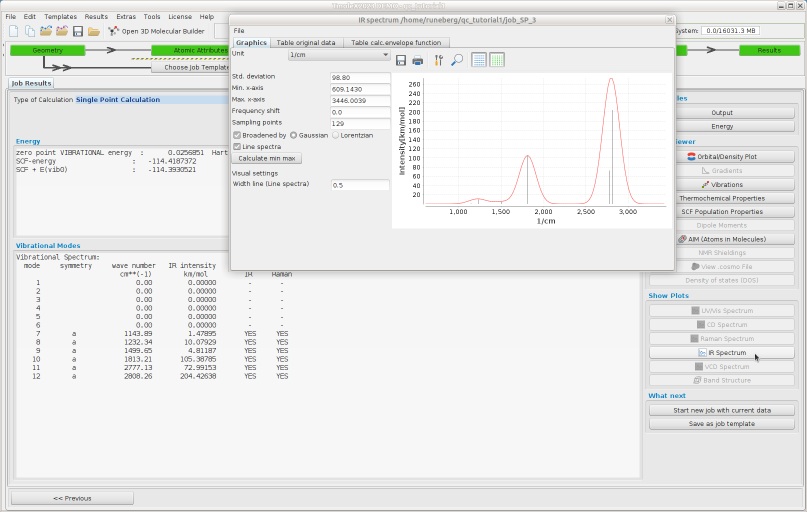

# Tutorial 1: Basic DFT calculations using TmoleX and TURBOMOLE

* Spring School on Computational Chemistry 17-19 April 2024
* Nino Runeberg, CSC - IT center for Science Ltd, based on the earlier work of Atte Sillanpää

## Overview

1. TmoleX is a graphical user interface to set up, launch and run jobs with TURBOMOLE
1. This tutorial is made for use with TmoleX 24 and TUBOMOLE 7.8
1. We'll use TmoleX to set up a formaldehyde geometry optimization
1. Configure and submit the job to be run on puhti.csc.fi supercomputer
1. Perform a subsequent frequency calculation on the optimized structure
1. Visualize results

## Remote usage setup at CSC

* TmoleX can be used either via a browser or by running it on your local 
  computer (see [Preparations](../preparations/README.md) )   
* The model system and input parameters for the TUBOMOLE job are specified  using TmoleX
* A connection to supercomputer puhti.csc.fi is set up in TmoleX using ssh. (The password is cleared upon closing the software)
* Installation directory and supercomputer specific options are set in TmoleX so that the GUI can
  launch the job for the queueing system (SLURM) on the Puhti
* TmoleX can follow the progress and once the job has completed, dowload the results to the local computer
* The CSC TmoleX page has more information.
* The overall CSC supercomputer environment can be found in the [Docs CSC user guide](https://docs.csc.fi/computing/available-systems/)
  or in the [CSC Computing environment self learning course materials](https://csc-training.github.io/csc-env-eff/).
* Aniother option is to use `ssh` and login directly on the Puhti login node, and prepare the job with `define`.


## Task 1: Optimize the ground state for formaldehyde

We need an initial guess for the geometry specifying the 3N-6 internal
nuclear coordinates. This initial structure place the system on the
energy surface that is uniquely defined by the computational model
we are going to use (B-O approx.).  The performance of the model
often vary at different parts of the surface.


## Task 1: Launch TmoleX and create a new project

### Use via your browser

Go to [puhti.csc.fi](https://puhti.csc.fi/) using a web browser and login using
your CSC/Haka user account.

1. From there [launch a Desktop](https://docs.csc.fi/computing/webinterface/desktop/#launching). 
2. Open a `Terminal` and load the TURBOMOLE module `module load turbomole/7.8`.
3. Start TmoleX with the command `TmoleX24`.

4. Select `New Project` and define a suitable project in the `File Name` slot
   (e.g. `/scratch/project_2006657/<your-username>/qc_tutorial1`).

5. Define your system and type of calculation. 
6. Small jobs can be run interactively: Start Job -> Run (local)
7. Larger jobs should be run as batch jobs: Start Job -> Run (network). Example
   settings are given below. Note that passwordless connection doesn't work via
   the browser. Remember to save the settings using `Save Machine`.
 
###  Use locally installed TmoleX

* If you have installed TmoleX on your own laptop, launch it from icon/menu
* On the CSC workstations TmoleX is already installed, launch it from icon/menu
* Note. TmoleX warns about not finding a license. This is ok. We'll use the TURBOMOLE license
on Puhti for the calculations. Accept the dialog.
* Define a suitable project directory (e.g. `~/qc_tutorial1`).


## Task 1: Define your first turbomole job



A complete Turbomole job comprises the sequence:

* **Geometry - Atomic Attributes - Molecular Attributes - Method - Start Job - Results**

The TURBOMOLE philosophy or program structure is based on running different
"modules" one after another. The following diagram
[taken from a TURBOMOLE tutorial](https://www.turbomole.org/wp-content/uploads/2019/10/Tutorial_7-4.pdf)
highlights the most typical ones and their relation.


## Task 1: Geometry -- Build formaldehyde

Open the 3D builder, right-click on canvas and load formaldehyde from the library


Close the builder and continue to Atomic Attributes

## Task 1: Atomic Attributes: Select basis set

Select the default def-SV(P) basis set

	

Continue to Molecular Attributes

## Task 1: Molecular Attributes -- Generate initial guess MOs

Generate initial MOs by doing an extended Hückel calculation


Continue to Method

## Task 1: Method -- Define your method

Select the default method (ri-dft BP86/m3)


Continue to Start Job

## Task 1: Start Job -- Define your job type

We want to do a geometry optimization of the ground state.


Continue to run (network)

## Task 1: Run(network) -- Setup remote job

Click **Save** as the first dialog prompts for the folder to use for the job files.

In the new dialog, we define the remote (supercomputer) configuration:
   * Which user account and project to use
   * Where TURBOMOLE is installed
   * etc.
   * Note, this will differ for every user and machine
   * General instructions for Puhti [docs.csc.fi/apps/tmolex/](https://docs.csc.fi/apps/tmolex/)
   * **important** Replace `your-username` with your actual username on CSC supercomputer! Also in the *Work directory*  field.

TURBOMOLE can be run in parallel either via a shared memory approach (SMP, only within a single node) or 
by using MPI parallelization (possible to run a job over several nodes). In this tutorial we will use the SMP version.


Use these:

* Machine/IP: `puhti.csc.fi`
* User: `<your-username>`
* Work directory: `/scratch/project_2006657/<your-username>`
* TURBOMOLE directory: `/appl/soft/chem/turbomole/7.8/TURBOMOLE`
* Use queuing system (tick)
* Submit with: `sbatch`
* Check status: `squeue -u $USER`

Script before job execution:

```bash
#SBATCH --reservation=sscc_thu_small                  # resource reservation for school
#SBATCH --partition=small                             # queue
#SBATCH --nodes=1                                     # for SMP only 1 is possible
#SBATCH --cpus-per-task=4                             # SMP threads
#SBATCH --account=project_2006657                     # insert here the project to be billed     
#SBATCH --time=00:30:00                               # time as `hh:mm:ss`
source /appl/profile/zz-csc-env.sh
ulimit -s unlimited
export PARA_ARCH=SMP                                  # use SMP threads
module load turbomole/7.8   
export PARNODES=$SLURM_CPUS_PER_TASK                  # for SMP
export PATH=$TURBODIR/bin/`$TURBODIR/scripts/sysname`:$PATH
```

* Check that your password is recognized by clicking `Check Password Settings` 

* Click **save machine** at the top right

Click **Start Job** at the bottom right

* For this tutorial, the default 1 minute interval to ping Puhti for the job status is ok, but for actual production jobs, that could be increased to e.g. 1 hour. The status can always be refreshed manually. This job should finish in seconds.



## Task 1: Results -- structure

The geometry optimization needed 5 cycles to reach the stationary point on the energy surface.


## Task 1: Results -- Gradients

The length of the arrows show how steep the energy surface is in that direction


At the end of the geometry optimization we have reached a stationary point
(gradient smaller than a given threshold) that could correspond to:



* a minimum **A**
* inflection point **B**
* a maximum **C**

The nature of the stationary point can be deduced from the curvature (Hessian).
A positive curvature corresponds to a minimum, a negative to a maximum.

## Task 1: Vibrational spectrum

In order to verify that the stationary point is a true minimum
(positive curvature in all directions = positive frequencies)

Start a frequency calculation (Reuse data by just hitting "Start new job by using current data as input" )



In the "Job typ" list select "Spectra & Excited States --> IR & vibrational frequencies"

Select "Run (Network)" to launch the job.

Once the job finishes (you can refresh the view - wait for results to get downloaded).
You can also log in on the supercomputer

```bash
ssh -Y your-username@puhti.csc.fi
```

and follow the job status with slurm commands more on these e.g. in
[CSC Computing Environment self learning materials](https://csc-training.github.io/csc-env-eff/hands-on/batch_resources/tutorial_sacct_and_seff.html)
directly, e.g. with:

```bash
squeue -u $USER # my current running or queuing jobs
sacct           # my ended jobs for the last day
sacct -X -o jobid,start,jobname,state,elapsed,alloc # last jobs with custom fields
```

A local terminal on Puhti also gives access to some additional tools and scripts
that come with TURBOMOLE that can be nice to follow or post process the data. You
can find these e.g.

```bash
module load turbomole/7.8
ls $TURBODIR/scripts/
cgnce -h # to get help on usage
actual -h 
```

All calculated frequencies are positive indicating that the structure corresponds to a true minimum.



The zero Kelvin minimum energy structure in a vacuum is often the starting point in solving
chemical problems. It often represents surprisingly well the molecular properties despite
all the approximations made. What could you use this information for? How to validate or improve
the model?

This ends the tutorial.


