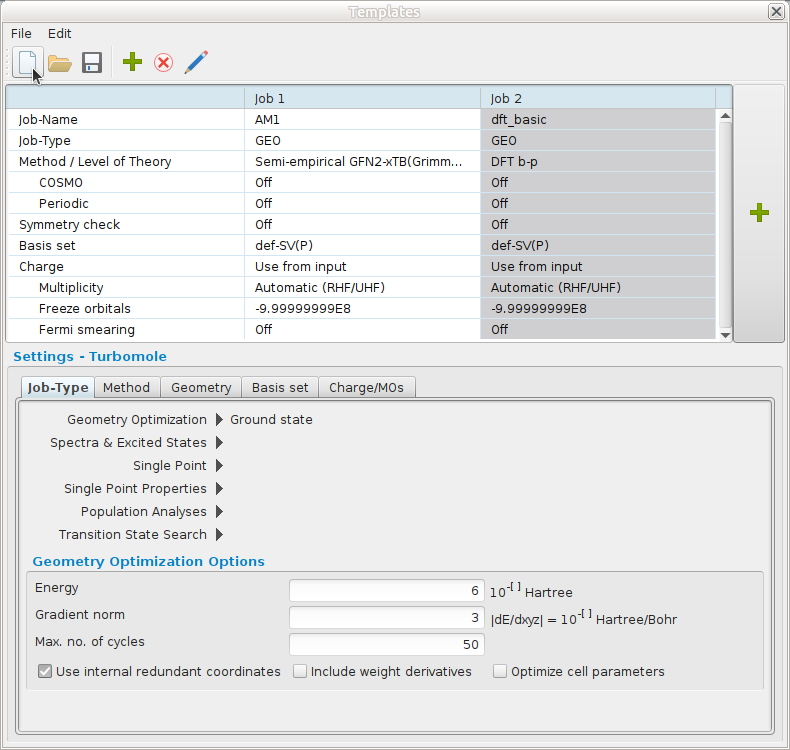
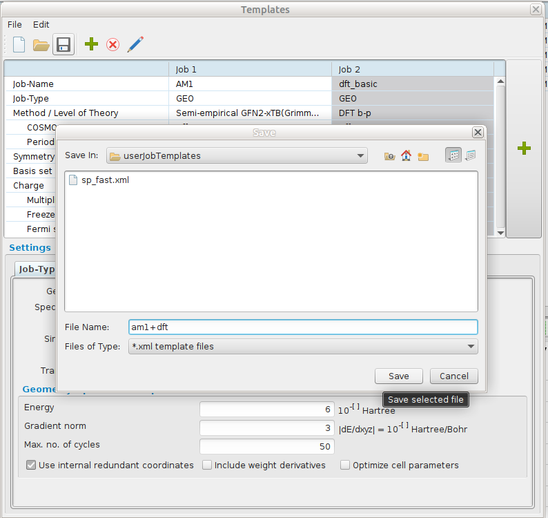

# Tutorial 2: Find the most stable structure of given isomers

* Spring School on Computational Chemistry 17-19 April 2024
* Nino Runeberg, CSC - IT center for Science Ltd, based on the earlier work of Atte Sillanpää

## Overview

1. We have downloaded from [PubChem](https://pubchem.ncbi.nlm.nih.gov/) a set of molecules having the same molecular formula C<sub>11</sub>H<sub>14</sub>O<sub>2</sub>N<sub>2</sub> . 
1. From the original set of about 14700 molecules we have selected 31 structures.  
   Their corresponding [SMILES](https://en.wikipedia.org/wiki/Simplified_molecular-input_line-entry_system) strings are  given in the table [https://siili.rahtiapp.fi/Duf0GbqtRVGrz2dZbPi5qg](https://siili.rahtiapp.fi/Duf0GbqtRVGrz2dZbPi5qg?view) 
1. Pick any of the free structures in that [table](https://siili.rahtiapp.fi/Duf0GbqtRVGrz2dZbPi5qg?view) and mark your name on the row (click on side-by-side icon at top left to edit ) 
1. Set up a calculation to get the minimum energy conformation according to the same recipe we used for formaldehyde
1. Tabulate the total energy of the corresponding optimized structure
1. Can you explain why some isomers are lower in energy than others?
1. **Bonus** Would the order change if you'd change the model? Improve basis set? Add an implicit solvent model? Include entropy estimate?

## Open TmoleX and create a new Project

1. Launch TmoleX and create a new project in a suitable directory.  
  * If you use the Puhti desktop then use something like  `/scratch/project_2006657/<your-username>/qc_tutorial2`. Remember to 
replace  `your-username` with your actual username in order to make it a unique and not interfering with other participants projects.
  * If you use a locally installed TmoleX then define the new project under your home directory, e.g. `~/qc_tutorial2` .
1. A new job is initiated within your new TmoleX project. 
1. Rename the first job in this project according to the `cid` identifier you picked fro mthe list

1. In the first `Geometry` subsection paste your SMILES string into the slot `SMILES to 3D`. Pushing the buttons should launch the TmoleX viewer showing the 3D structure of the molecule corresponding to your SMILES string.

1. Since the conversion from `SMILES` to `xyz` is quite rough it's often a good idea to do a preoptimization. 

1. Continue in a similar way as we did with formaldehyde and optimize the structure.
 
1. Once the structure optimization has (hopefully) converged, fill in the total energy of that structure into the table.
  


## Examine how long it took to run the job

When a job has finished, all output files are transferred to your local job and deleted from Puhti's work directory.
Amoung the result files yous should have a file called `slurm-XXXXXXXXXX.out` where `XXXXXXXXXX`is replaced with a 
number that corresponds to the `JOBID` the job had in Puhti's queuing system.
If you would like to have a closer look at the details of that job you should login to Puhti
```bash
ssh  your-username@puhti.csc.fi
```
Once logged into Puhti you can use the command `sacct` to collect various data related to the job. Give the command (replace JOBID with the actual number)

```bash
sacct -X -j JOBID -o state,start,alloc,elapsed,cputime
     State               Start  AllocCPUS    Elapsed    CPUTime 
---------- ------------------- ---------- ---------- ---------- 
 COMPLETED 2024-04-15T15:11:06          4   00:10:51   00:43:24 
```
Here the `Elapsed` time is the wall time the job took to finish. 

Use an optimized structure and define a new job, `Start new job with current data`, where you do define the job as a 
`Single Point -> Energy & Gradient (ground state)`. Do this calculation  using 1,2,4 and 8 cores. 
Tabulate the values into a table. You can calculate the "speedup" by
dividing the 1 core time with N core time. Linear speedup would equal
the number of cores used. A speedup above 1.4 when doubling the number of cores is often considered as reasonable. 


|  cores     |   walltime  | speedup  |
| ---------- | ----------- |   -----: |
|    1       |             |          |
|    2       |             |          |
|    4       |             |          |
|    8       |             |          |

## Discussion

* Why do the numbers differ?
* Why do these number matter?
* Are these numbers accurate?
* How to get more accurate information?
* What else affects the performance?


## TmoleX and workflows

Occationally you have designed a certain type of model/procedure that you would like to apply to a bunch of different structures. 
An example was the preoptimization followed by an optimization at a higher level. Such batch jobs can be easily done with TmoleX.

1. Create a new project and select `Templates -> New/Edit Template`


2. Define two job steps corresponding to an AM1 geometry optimization followed by a dft/bp86/sv(p) optimization.




3. Create a batch `New Batch Job` and hit `Add List of SMILES`. In that window add some of the our SMILES strings followed by a name (here the cid number)


4. For the batch of molecules `Choose Job Template` -> `Charge: Use from input` -> `Apply Job Template`   

  
  
This ends the tutorial.


